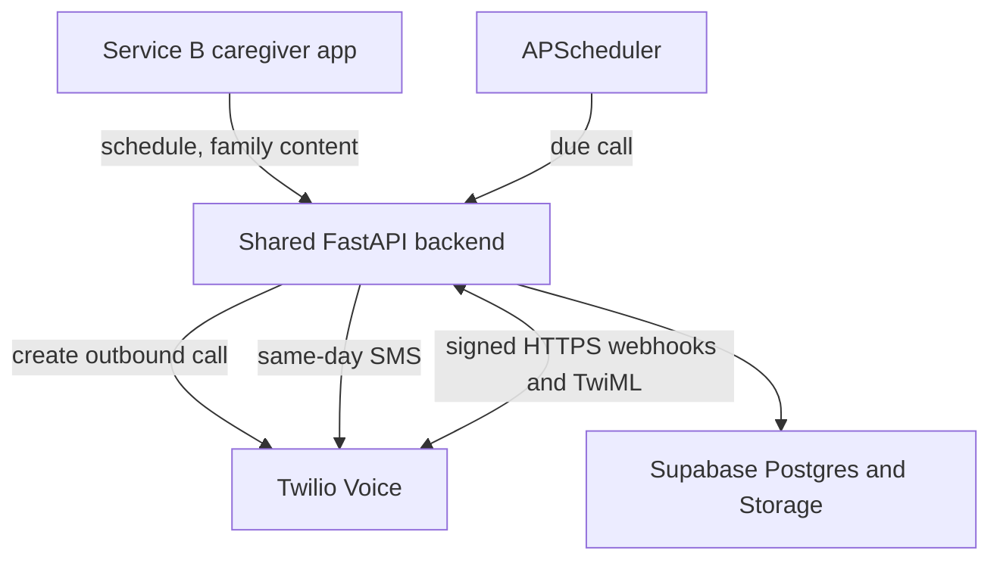
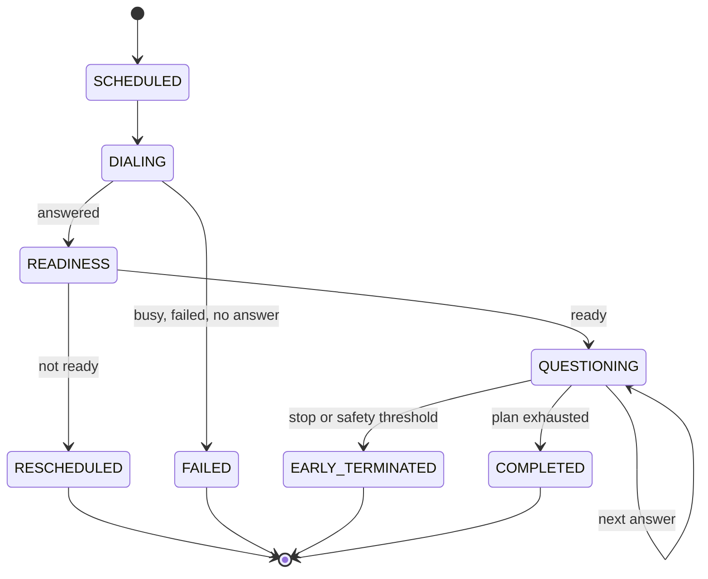

# Service A — Architecture Document

**Service:** Memory Assistance Calling Companion  
**Scope:** Hackathon prototype; logical service inside a shared modular backend  
**Safety boundary:** This architecture produces assistive observations and caregiver signals, not diagnoses or medical conclusions.

## 1. Architecture Summary

Service A is a logical module in one Python/FastAPI deployable. Keeping Service A, Service B APIs, the shared session repository, alert rules, and ML code in the same backend removes unnecessary network boundaries for a short hackathon. The code remains separated by module so each responsibility is clear.

Twilio places and controls the external phone call. FastAPI supplies TwiML for each conversation step and persists state in shared Supabase Postgres. Service B remains the management surface for caregivers and provides family memories, voice assets, schedules, and notification settings.

### Deployment shape

- **One backend container:** FastAPI API, scheduler, Service A call engine, Service B domain APIs, alert rules, and ML module.
- **One web application:** Next.js Service B client, deployed separately or served behind the same domain.
- **One managed data platform:** Supabase Postgres, Auth, and private Storage.
- **One communication provider:** Twilio Programmable Voice and Messaging.
- **One public HTTPS endpoint:** required for Twilio callbacks; a tunnel may be used during local development.

This is deliberately not a microservice architecture.

## 2. System Components

| Component | Responsibility |
|---|---|
| `call_scheduler` | Reads active `CallSchedule` rows, creates due call jobs, reconciles missed jobs after a restart, and enforces one optional reschedule within quiet hours |
| `call_orchestrator` | Creates `CallAttempt` and `CognitiveSession`, calls Twilio, advances the finite-state conversation, and finalizes the session |
| `question_planner` | Builds a 5–8-item plan; fixes day/time orientation at position 1; shuffles other eligible categories; avoids repeating the previous complete sequence |
| `answer_evaluator` | Normalizes speech, checks configured aliases/accepted answers, handles missing/low-confidence STT as `UNSCORABLE`, and calculates deterministic result fields |
| `twiml_controller` | Returns concise TwiML for greeting, readiness, prompts, gentle reinforcement, repeat, closing, and reschedule paths |
| `twilio_webhook_guard` | Validates `X-Twilio-Signature`, rejects invalid requests, and provides idempotency keys for retry-safe handling |
| `session_repository` | Writes `CognitiveSession`, `SessionMetric`, `CallAttempt`, and `CallQuestion` data to shared Postgres |
| `asset_adapter` | Generates a short-lived URL for an active family voice clip so Twilio can use `<Play>` without making the storage bucket public |
| `alert_rule_engine` | Classifies finalized sessions as `ROUTINE` or `SAME_DAY`; creates a deduplicated `AlertEvent` only for `SAME_DAY` |
| `notification_adapter` | Sends same-day and optional routine SMS through Twilio and records provider delivery state |
| `mock_telephony_adapter` | Replays deterministic webhook fixtures for development, tests, and a fallback demo; cannot be enabled in the live configuration accidentally |

## 3. Call State Machine

`READINESS` is not an evaluated cognitive question. The first evaluated item after readiness is always `ORIENTATION_DAY_TIME`. `RESCHEDULED` terminates the current session; the scheduler creates a new `CallAttempt` and `CognitiveSession` for the one permitted later attempt.

### Question-plan rules

1. Load active, consented `FamilyMemory` records and the small general-awareness bank.
2. Create the first item as day/time orientation using the patient’s configured IANA time zone.
3. Choose at least one eligible family-recognition item and, where content exists, relationship and family-voice items.
4. Include no more than one general-awareness item.
5. Shuffle positions 2 onward with a seeded random value saved in `CognitiveSession.metadata_json`.
6. Compare the generated category/reference sequence with the previous completed call and reshuffle once if identical.
7. If fewer than five safe items exist, use alternate orientation/familiarity prompts. Never invent personal facts.

### Answer-classification rules

| Condition | Classification | Metric treatment |
|---|---|---|
| Normalized transcript matches an accepted answer or alias | `CORRECT` | Accuracy `1.0` |
| Confident transcript is a clear non-match | `INCORRECT` | Accuracy `0.0`; increment consecutive-incorrect counter |
| Missing transcript, absent confidence when needed, low confidence, ambiguous answer, or STT error | `UNSCORABLE` | Accuracy `null`; one neutral repeat permitted; do not increment incorrect counter |
| Patient says stop/end or configured synonym | `STOP` | Accuracy `null`; finalize early |
| Question is bypassed because content is unavailable | `SKIPPED` | No accuracy metric |

The prototype uses case/whitespace normalization, Unicode normalization, caregiver-supplied aliases, and conservative fuzzy matching for names. It does not use an LLM to decide whether the patient is correct.

**Call-latency definition:** Twilio `<Gather>` does not supply an exact “prompt playback finished” timestamp in this flow. Service A stores `prompt_issued_at`, known/estimated prompt or clip duration, and answer-webhook receipt time, then derives an approximate response latency. CALL latency is compared only with the patient’s comparable CALL/activity baseline before cross-source aggregation; it is not presented as a clinical reaction-time test.

## 4. Component Communication and Data Flow

### Scheduled outbound call

1. `call_scheduler` claims a due `CallSchedule` using a database lock/idempotency key of `schedule_id + local_date + attempt_number`.
2. `call_orchestrator` inserts `CallAttempt(status=SCHEDULED)` and `CognitiveSession(source=CALL,status=IN_PROGRESS)`.
3. It asks Twilio to create an outbound call with an absolute TwiML URL and status-callback URL.
4. Twilio posts to `/webhooks/twilio/voice/start`. The guard validates the signature and `CallSid`.
5. FastAPI returns TwiML containing the greeting and readiness `<Gather input="speech">`.
6. Each Twilio `action` webhook carries the next state. FastAPI reloads server-side state, handles the event idempotently, stores the observation, and returns the next TwiML response.
7. Twilio call-progress callbacks update `CallAttempt` without overwriting a more advanced terminal state.
8. On completion or early termination, one transaction finalizes the session, derives aggregates, and enqueues alert evaluation.

### Family voice-clip playback

1. Service B uploads a consented clip to a private Storage bucket and creates `FamilyMemory(type=VOICE)`.
2. `question_planner` references the memory; it does not copy the audio.
3. Immediately before the prompt, `asset_adapter` creates a short-lived signed media URL.
4. TwiML uses `<Play>` for that URL, then gathers a recognition answer.
5. Expiry or playback failure converts the item to `SKIPPED`; it is not counted as an incorrect response.

### Finalization and alerts

- `session_repository` calculates scorable accuracy, average response latency, hesitation count, completion state, and a non-clinical `session_score`.
- `alert_rule_engine` runs synchronously after the committed session so a database failure cannot produce an alert without supporting data.
- SMS delivery is asynchronous. The persisted `AlertEvent` is the source of truth; SMS is only a delivery channel.
- The shared ML assessment may refresh after the session. Failure of ML does not block session persistence or the rule-based safety alert.

## 5. Data Models

All IDs are UUIDs unless a provider supplies its own identifier. Timestamps are UTC; schedules retain an IANA time zone.

### Service A entities

| Entity | Important fields | Notes |
|---|---|---|
| `CallSchedule` | `schedule_id`, `patient_id`, `local_time`, `timezone`, `days_of_week`, `quiet_hours`, `language_code`, `active`, `allow_one_retry`, `updated_at` | Written from Service B; read by Service A |
| `CallAttempt` | `attempt_id`, `session_id`, `schedule_id`, `provider_call_sid`, `scheduled_for`, `attempt_number`, `status`, `failure_code`, `created_at`, `updated_at` | `provider_call_sid` and schedule idempotency key are unique |
| `CallQuestion` | `call_question_id`, `session_id`, `position`, `item_type`, `memory_id`, `prompt_snapshot`, `accepted_answers_json`, `result`, `repeat_count`, `transcript_fragment`, `stt_confidence`, `response_latency_ms` | Transcript is minimized; no raw audio is retained |
| `QuestionBankItem` | `question_id`, `item_type`, `prompt_template`, `accepted_answers_json`, `language_code`, `active` | Contains orientation/general-awareness templates only, never invented family facts |

### Shared entities used by Service A

| Entity | Important fields | Purpose |
|---|---|---|
| `Family` | `family_id`, `mode` (`SOLO`/`GROUP`), `created_at` | Parent scope for caregiver-managed data |
| `Patient` | `patient_id`, `family_id`, `preferred_name`, `phone_e164`, `timezone`, `preferred_language`, `active` | Profile configured by caregiver |
| `FamilyMemory` | `memory_id`, `patient_id`, `type`, `subject_name`, `relationship`, `prompt_text`, `accepted_answers_json`, `asset_id`, `active`, `consent_recorded_at` | Service B owns; Service A reads active items |
| `CognitiveSession` | `session_id`, `patient_id`, `source` (`CALL`/`GAME`), `activity_type`, `started_at`, `ended_at`, `duration_ms`, `status`, `termination_reason`, `session_score`, `summary_accuracy`, `average_response_latency_ms`, `hesitation_count`, `review_classification` (`ROUTINE`/`SAME_DAY`), `metadata_json` | Canonical session record for both services |
| `SessionMetric` | `metric_id`, `session_id`, `patient_id`, `item_type`, `accuracy`, `average_response_latency_ms`, `hesitation_count`, `difficulty`, `recorded_at`, `metadata_json` | One row per evaluated item/round; `difficulty` is nullable for calls |
| `AlertEvent` | `alert_id`, `patient_id`, `session_id`, `classification` (`SAME_DAY`), `reason_code`, `reason_text`, `created_at`, `delivery_status`, `dedupe_key` | Created only when same-day attention is warranted; plain-language and non-diagnostic |
| `NotificationPreference` | `patient_id`, `same_day_sms_enabled`, `routine_sms_enabled`, `caregiver_phone_e164`, `reminders_paused` | Controlled by caregiver |
| `TrendAssessment` | `assessment_id`, `patient_id`, `trend_status`, `reason_text`, `baseline_start`, `baseline_end`, `recent_start`, `recent_end`, `data_sufficiency`, `created_at` | Produced by Service B’s internal ML layer from CALL and GAME data |

### Integrity rules

- A `CognitiveSession` belongs to exactly one patient and has exactly one source.
- Every `SessionMetric.patient_id` must match its parent session’s patient.
- `summary_accuracy` ignores `UNSCORABLE` and `SKIPPED` items and records the scorable count.
- `duration_ms` and latency values cannot be negative.
- Terminal session states are `COMPLETED`, `EARLY_TERMINATED`, `INTERRUPTED`, `FAILED`, and `RESCHEDULED`.
- Only one alert may use the same `dedupe_key`, normally `patient_id + session_id + reason_code`.
- Deleting a family account removes or schedules deletion of all owned patient data and assets; no retention prompt is used.

## 6. API Contracts

Caregiver endpoints require a valid Supabase access token and family membership. Twilio endpoints require a valid Twilio signature. Internal module calls do not use HTTP.

### Caregiver and operator endpoints

| Method and path | Purpose | Main request fields | Main response fields |
|---|---|---|---|
| `PUT /v1/patients/{patient_id}/call-schedule` | Create/update daily call behavior | `local_time`, `timezone`, `days_of_week`, `quiet_hours`, `language_code`, `active`, `allow_one_retry` | `schedule_id`, normalized schedule, `next_run_at` |
| `POST /v1/patients/{patient_id}/call-schedule/pause` | Pause or resume in one action | `paused` | `active`, `updated_at` |
| `POST /v1/patients/{patient_id}/calls/trigger` | Start an immediate demo call | `reason=DEMO|CAREGIVER`, optional `question_count` (5–8) | `attempt_id`, `session_id`, `status` |
| `GET /v1/patients/{patient_id}/call-sessions` | Return call history for the unified family view | `limit`, optional cursor | session summaries and next cursor |

### Twilio webhook endpoints

| Method and path | Purpose | Main Twilio/request fields | Response |
|---|---|---|---|
| `POST /webhooks/twilio/voice/start` | Greet and gather readiness | `CallSid`, `CallStatus`; signed opaque session token in URL | TwiML greeting + readiness gather |
| `POST /webhooks/twilio/voice/readiness` | Continue, reschedule, stop, or repeat | `CallSid`, `SpeechResult`, optional `Confidence` | TwiML first question, reschedule closing, or one repeat |
| `POST /webhooks/twilio/voice/answer` | Evaluate one item and advance state | `CallSid`, `SpeechResult`, optional `Confidence`; signed question token | TwiML reinforcement + next item/closing |
| `POST /webhooks/twilio/voice/status` | Track provider progress/terminal state | `CallSid`, `CallStatus`, error fields when present | `204 No Content` |
| `POST /webhooks/twilio/sms/status` | Track notification delivery | message identifier and delivery state | `204 No Content` |
| `GET /v1/twilio/assets/{asset_id}` | Supply a time-limited family voice asset | signed token, expiry | streamed audio or `404/410` |

Webhook handlers accept form-encoded data and use all received fields during signature validation. They never trust a patient/session identifier from the request without matching it to the provider call and signed opaque token.

## 7. Same-Day Alert Rules

The rule engine separates cognitive observations from operational failures.

### `SAME_DAY` candidates

A finalized session creates a same-day candidate when at least one of these holds:

1. **Severe family-recognition failure:** all scorable family-recognition items in a session are incorrect, with at least two evaluated items.
2. **Safety-related termination:** the patient explicitly asks to stop after difficulty, or the session ends at the consecutive-incorrect threshold. A simple call drop does not qualify.
3. **Combined baseline deviation:** with sufficient history, activity-adjusted accuracy is at least 2 baseline standard deviations worse **and** latency is at least 1.5 standard deviations slower.
4. **Multiple concerning indicators:** one strong deviation plus repeated hesitation/no-input or an unusual early termination.

One ordinary mistake, one slow answer, provider failure, no answer, or an `UNSCORABLE` transcript remains routine. Same-day alerts are deduplicated per session/reason and worded as “a change that may need attention,” never “decline detected” or a diagnosis.

## 8. Third-Party Services

| Dependency | Use | Why selected | Required? | Prototype limitation |
|---|---|---|---|---|
| Twilio Programmable Voice | Real outbound calls, TwiML, speech gather, call-status callbacks | Directly satisfies the no-app phone requirement | Yes | Account permissions, trial restrictions, network quality, provider/model changes, and language availability can affect the demo |
| Twilio `<Say>` TTS | Slow spoken prompts; neural voice where supported | Avoids hosting every prompt as audio | Replaceable later | Voice/language/SSML combinations must be tested; not every regional language is available |
| Twilio speech `<Gather>` | Returns speech transcript and optional confidence | Simplest call-turn input for the prototype | Replaceable later | Confidence is not guaranteed; accents/noise may reduce quality; low-confidence input is not scored incorrect |
| Twilio Messaging | Same-day alert and optional routine-summary SMS | Reuses the existing provider | Replaceable | Delivery is asynchronous and may fail; stored session history or same-day `AlertEvent` remains authoritative |
| Supabase Postgres | Shared relational persistence | One database supports joins, transactions, and both services | Yes, but standard Postgres is replaceable | Managed-service/network availability; schema migrations still required |
| Supabase Storage | Private family voice clips | Integrates with the shared project and short-lived URLs | Replaceable | Twilio must be able to fetch a temporary URL during playback |
| Public HTTPS host/tunnel | Receives Twilio webhooks | Twilio cannot call localhost directly | Yes for live calls | Tunnel URLs may change; configure the exact public URL before testing signatures |

## 9. Architectural Decisions

| Decision | Rationale |
|---|---|
| Modular monolith, not microservices | One team can build, debug, deploy, and demo it quickly while keeping logical service boundaries |
| Shared Postgres tables for cognitive data | Eliminates synchronization drift and gives ML/alerts one source of truth |
| Finite-state call flow, not a free-form AI agent | Predictable, testable, dignified, fast, and less likely to hallucinate or give unsafe advice |
| Deterministic answer matching | Appropriate for known family facts and a small awareness bank; avoids opaque grading |
| No raw patient call recording | Unnecessary for the demo and creates avoidable privacy/consent risk |
| Low-confidence input is unscorable | STT uncertainty must not be treated as patient failure |
| Early termination overrides completion | Patient comfort and dignity are more important than collecting a full dataset |
| Persist alert before sending SMS | A delivery failure must not erase the underlying signal |
| Service B owns family content/settings | Caregiver management lives in one place; Service A consumes only active, consented records |
| ML remains inside Service B backend module | It needs both services’ data but does not justify a separate deployment for the prototype |

## 10. Architecture Principles and Prototype Boundaries

- Build only the path needed to demonstrate a real call, safe interaction, shared persistence, unified analysis, and caregiver notification.
- Keep patient-facing language supportive and non-diagnostic.
- Store the minimum data required; exclude raw audio and secrets from logs.
- Validate Twilio signatures and make webhook processing idempotent even in the prototype.
- Use activity/source labels so call and game observations can be normalized rather than compared naively.
- Treat regional-language coverage as an empirical integration test, not a slide-deck claim.
- Do not add queues, Kubernetes, event buses, vector databases, LLMs, or production compliance programmes unless the prototype cannot work without them.
- Production security, consent governance, clinical validation, auditability, high availability, and regulatory assessment belong in future work.

## 11. Verification Strategy

| Test level | Required checks |
|---|---|
| Unit | question count/order; randomization; alias matching; low-confidence handling; consecutive-incorrect threshold; reschedule/quiet-hour logic; alert thresholds |
| Contract | generated TwiML is valid XML; each gather action points to the expected absolute URL; webhook signature validation accepts official fixtures and rejects tampering |
| Repository integration | session finalization creates exactly one CALL session and expected metrics; duplicate webhooks remain idempotent; SMS failure preserves alert |
| Mock end to end | scripted readiness, correct, incorrect, silence, stop, and provider-failure conversations |
| Live end to end | one verified phone completes a 5–8-question call; one reschedule path; one seeded same-day alert; results appear in Service B |

The live test must use consented/synthetic demo data and a language/voice combination already verified on the actual call route.
