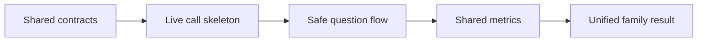

# Service A — Development Phases

**Service:** Memory Assistance Calling Companion  
**Planning basis:** Small team, 30–36-hour hackathon, one shared backend with Service B  
**Build rule:** Protect the minimum live path first: **manual trigger → real Twilio call → safe 5-question flow → shared metrics → family-visible result**.

## 1. Delivery Priorities

### MUST HAVE — minimum viable demo

1. One live outbound Twilio call to an approved phone.
2. Readiness check plus a 5-question call with orientation first.
3. At least family recognition, relationship recognition, and one general-awareness item; family-voice playback is included if the asset path is stable.
4. Gentle correct/incorrect/unscorable handling and early termination at the safety threshold.
5. One `CognitiveSession(source=CALL)` plus `SessionMetric` rows in shared Postgres.
6. Unified family history showing the call.
7. One routine fixture and one same-day-alert fixture with correct separation.
8. Mock-call mode for deterministic development and fallback evidence.

### SHOULD HAVE — after the live path is stable

- Daily schedule and one +60-minute reschedule.
- Neural TTS/SSML pacing on a verified voice.
- Family voice-clip recognition through private Storage.
- Same-day Twilio SMS and optional routine summary.
- A second verified demo language.

### FUTURE WORK — do not pull into the hackathon critical path

- Broad NER-language coverage, free-form voice AI, raw-audio analysis, clinician portal, production consent/audit systems, high availability, multi-provider failover, native patient app, or medical validation.

## 2. Phase Plan

### Phase 0 — Shared Contract Freeze

**Time box:** 1–2 hours  
**Objective:** Prevent Service A and Service B from producing incompatible patient/session data.

**Tasks**

- Agree exact enums and fields for `CognitiveSession`, `SessionMetric`, `AlertEvent`, `Patient`, `FamilyMemory`, and `NotificationPreference`.
- Fix session sources as `CALL` and `GAME`.
- Fix terminal statuses as `COMPLETED`, `EARLY_TERMINATED`, `INTERRUPTED`, `FAILED`, and `RESCHEDULED`.
- Define the Service A fixture patient, synthetic family facts, accepted aliases, test phone, time zone, and consent-safe voice clip.
- Add environment templates without credentials.
- Assign one owner for the shared migration files.

**Dependencies**

- Service B data/integration lead available for a 30-minute contract review.
- Supabase project and Twilio account exist.

**Definition of done**

- One reviewed schema/migration is the only shared model.
- Both services can insert/read a fixture `CognitiveSession`.
- No real patient data is required for development.

**Demonstrable at phase end**

- A database query or API response shows one synthetic CALL session and one synthetic GAME session using identical entity names.

---

### Phase 1 — Telephony Skeleton and Deterministic Call State

**Time box:** 4 hours  
**Objective:** Place a real call and advance through server-controlled states without cognitive scoring yet.

**Tasks**

- Create the `telephony` module and a `TelephonyAdapter` interface with `TwilioAdapter` and `MockAdapter`.
- Configure a public HTTPS callback URL and Twilio outbound number.
- Implement `POST /v1/patients/{patient_id}/calls/trigger`.
- Implement signed Twilio webhook routes for start, readiness, answer, and call status.
- Validate `X-Twilio-Signature` using the exact external URL.
- Build the state machine: `SCHEDULED → DIALING → READINESS → QUESTIONING → terminal`.
- Store `CallAttempt` and provider `CallSid`; make duplicate callbacks idempotent.
- Return a greeting, readiness gather, one placeholder prompt, and warm closing.

**Dependencies**

- Phase 0 schema.
- Twilio number/destination permissions and credentials.
- Public HTTPS host or tunnel.

**Definition of done**

- A live phone rings and completes greeting → readiness → one answer → closing.
- A tampered webhook is rejected.
- Replaying the same webhook creates no duplicate row or transition.
- Mock mode exercises the identical state transitions without calling Twilio.

**Demonstrable at phase end**

- Operator clicks/triggers a call; the phone rings; backend status moves to `COMPLETED`.

---

### Phase 2 — Safe 5–8-Question Session

**Time box:** 5–6 hours  
**Objective:** Complete the real patient interaction logic and capture item observations.

**Tasks**

- Implement `question_planner` with 5–8 items, orientation at position 1, randomized later categories, and no identical consecutive sequence.
- Load active, consented `FamilyMemory` records; never synthesize personal facts.
- Implement transcript normalization, aliases, conservative RapidFuzz matching, and `CORRECT`/`INCORRECT`/`UNSCORABLE`/`STOP`/`SKIPPED`.
- Treat absent/low confidence as unscorable and permit one neutral repeat.
- Implement gentle reinforcement phrases reviewed by the product/safety owner.
- Track response latency and observable hesitation events.
- Implement the safety rule: easier/continue check after 2 consecutive incorrect; warm early close at 3, explicit stop, or repeated no-input.
- Persist `CallQuestion` and `SessionMetric` per evaluated item.
- Implement one validated family voice `<Play>` path using a signed private URL. If an individual asset expires or fails during a call, skip that item without penalizing the patient.

**Dependencies**

- Phase 1 state machine.
- Seeded question bank and consent-safe family content.

**Definition of done**

- All-correct fixture completes 5–8 questions.
- First evaluated item is always orientation.
- Three-consecutive-incorrect and explicit-stop fixtures end early with correct reasons.
- Low-confidence and failed voice-asset fixtures do not reduce accuracy.
- A valid family voice clip plays successfully and its recognition answer produces a metric.
- No response branch shames, diagnoses, or repeatedly corrects the patient.

**Demonstrable at phase end**

- A scripted live/mock session visibly changes order after the first question and terminates gently when the safety rule is triggered.

---

### Phase 3 — Shared Metrics, Unified View, and Alert Separation

**Time box:** 4–5 hours  
**Objective:** Turn the call into shared, explainable data that Service B can consume.

**Tasks**

- Finalize `CognitiveSession` in one transaction with duration, status, termination reason, scorable count, summary accuracy, average latency, hesitation count, and non-clinical `session_score`.
- Invoke the shared `alert_rule_engine` only after session commit.
- Implement same-day rules for severe family-recognition failure, safety-related termination, and combined baseline deviation.
- Ensure one mistake, no answer, provider failure, or unscorable STT remains routine.
- Create deduplicated `AlertEvent` with a plain-language reason.
- Expose call sessions through the same unified patient history used for GAME sessions.
- Connect the existing Service B overview/trend read model to CALL data.

**Dependencies**

- Phase 2 metrics.
- Service B unified history/overview contract.
- Shared ML integration may be stubbed with deterministic baseline fixtures during this phase.

**Definition of done**

- One call appears in the family history with `source=CALL`.
- Routine fixture creates no same-day alert.
- Each severe fixture creates exactly one same-day alert after webhook replay.
- Alert reason uses “observed change”/“may need attention,” never diagnosis language.

**Demonstrable at phase end**

- Finish a call, refresh the family view, and show the new call alongside a game session and its correct alert/routine status.

---

### Phase 4 — Scheduling, Rescheduling, and SMS

**Time box:** 3–4 hours  
**Objective:** Demonstrate the daily companion behavior and caregiver notification path.

**Tasks**

- Implement APScheduler loading active `CallSchedule` records.
- Use `schedule_id + local_date + attempt_number` uniqueness to prevent duplicate calls.
- Respect IANA time zone, permitted days, quiet hours, and immediate pause.
- Implement the “not ready” branch with at most one default +60-minute attempt.
- Reconcile a small missed-run window at startup without placing multiple catch-up calls.
- Send Twilio SMS for persisted `SAME_DAY` alerts when enabled.
- Update `delivery_status` from Twilio callback; keep failed messages visible in Service B.
- Add manual retry for a failed alert message if time permits.

**Dependencies**

- Phase 3 finalized sessions and alerts.
- Service B schedule/notification settings.

**Definition of done**

- A near-future scheduled call fires once within ±60 seconds in the demo environment.
- “Not ready” schedules exactly one later attempt inside quiet hours.
- Pausing prevents the next call immediately.
- A same-day alert persists before SMS and remains visible if the SMS adapter is forced to fail.

**Demonstrable at phase end**

- Caregiver sets a near-future time; the phone receives one call; a seeded concerning session produces one concise caregiver SMS and one in-app alert.

---

### Phase 5 — Edge Cases, Live Language Test, and Demo Lock

**Time box:** 4 hours plus buffer  
**Objective:** Stabilize the exact judge journey and preserve an honest fallback.

**Tasks**

- Run the full fixture matrix: correct, incorrect recovery, early termination, stop, low confidence, silence, no answer, busy, duplicate callback, expired asset, database failure, SMS failure.
- Test the actual selected Twilio STT model/TTS voice on the actual phone network and record the verified language configuration.
- Measure webhook response and finalization times.
- Redact logs and confirm no raw audio recording is enabled.
- Seed deterministic synthetic family data and reset scripts.
- Prepare a mock-call replay and screenshots/log evidence of the last successful live call.
- Freeze features; fix only defects affecting the demo path.
- Rehearse the shared end-to-end narrative with Service B and the ML output.

**Dependencies**

- Phases 1–4 complete.
- Stable deployed URLs and demo credentials.

**Definition of done**

- Three consecutive rehearsals complete without manual database edits.
- All MUST HAVE acceptance tests pass.
- The team can demonstrate both live and deterministic fallback paths and label them accurately.
- Known language/provider limits are stated, not hidden.

**Demonstrable at phase end**

- Judge-ready flow: configure/trigger → real call → safe response handling → shared session → unified trend/alert → caregiver notification.

## 3. Critical Path and Parallel Work

Only this chain can make the concept credible. Scheduling, a second language, rich routine summaries, and extra polish are subordinate.

After Phase 0, safe parallel work is possible:

- Telephony lead: call state/TwiML.
- Data lead: repositories, migrations, idempotency, unified read model.
- Product/safety owner: question bank, aliases, response wording, alert fixtures.
- QA/demo owner: mock adapter scripts, live-account checks, reset/rehearsal checklist.

Merge at the end of each phase; do not let parallel branches invent new entity names or enums.

## 4. Cut Plan if Time Runs Short

Cut in this order:

1. Second demo language.
2. Routine SMS summary.
3. Neural/SSML voice tuning; retain a verified standard voice.
4. Optional no-answer retry; retain the required readiness reschedule path.
5. Caregiver-facing pronunciation-hint editing; retain seeded accepted aliases.

Do **not** cut:

- Real Twilio call evidence.
- Scheduled call execution and readiness rescheduling.
- Orientation first.
- One working pre-recorded family voice-recognition path.
- Safe incorrect/unscorable/stop behavior.
- Early termination.
- Shared CALL metrics.
- Routine versus same-day distinction.
- Unified family result.
- Non-diagnostic wording.

## 5. Demo Runbook

1. Reset only the synthetic demo patient’s sessions/alerts; preserve configuration.
2. Confirm backend health, database access, Twilio balance/permissions, callback URL, selected language/voice, and Service B login.
3. Open the family patient overview with one prior GAME session visible.
4. Trigger the call and show `DIALING` without exposing the phone number.
5. Answer readiness, day/time orientation, and varied family/general prompts.
6. Use either the normal completion path or the preselected early-termination path; do not improvise distress content.
7. Show the new `CALL` session beside the GAME session.
8. Show why the result is routine or same-day and the caregiver action language.
9. Show the refreshed combined trend with its baseline/recent dates and non-diagnostic reason.
10. If the live provider path fails, state the provider failure honestly, show the correctly recorded `FAILED` attempt, and run the deterministic mock fixture. Never present the mock as a live call.

## 6. Final Acceptance Checklist

- [ ] Real outbound Twilio call verified on the demo destination.
- [ ] 5–8 questions; orientation always first; later order randomized.
- [ ] `UNSCORABLE` is distinct from incorrect.
- [ ] Explicit stop and 2–3-consecutive-incorrect safety behavior passes.
- [ ] No raw patient call recording.
- [ ] One idempotent CALL session and correct metrics are persisted.
- [ ] Routine variation does not generate a same-day alert.
- [ ] Severe fixture generates one deduplicated same-day alert.
- [ ] Service B displays a unified CALL + GAME patient view.
- [ ] Twilio webhooks validate signatures and return within the target latency.
- [ ] Pause reminders works in one direct action.
- [ ] Mock path is visibly labelled and cannot be confused with live success.
- [ ] Team states the assistive/not-diagnostic boundary and regional-language limitation.
