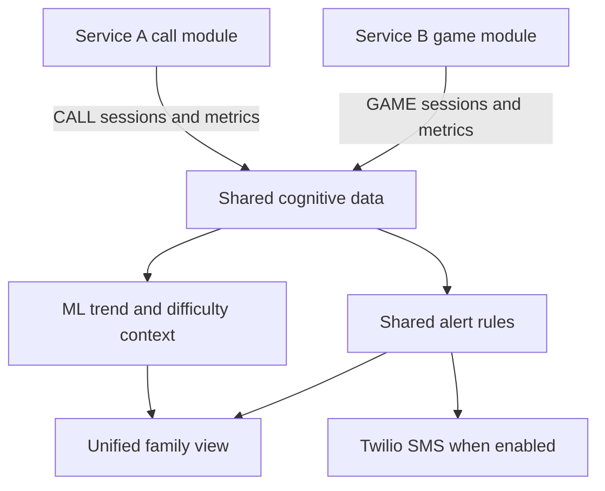
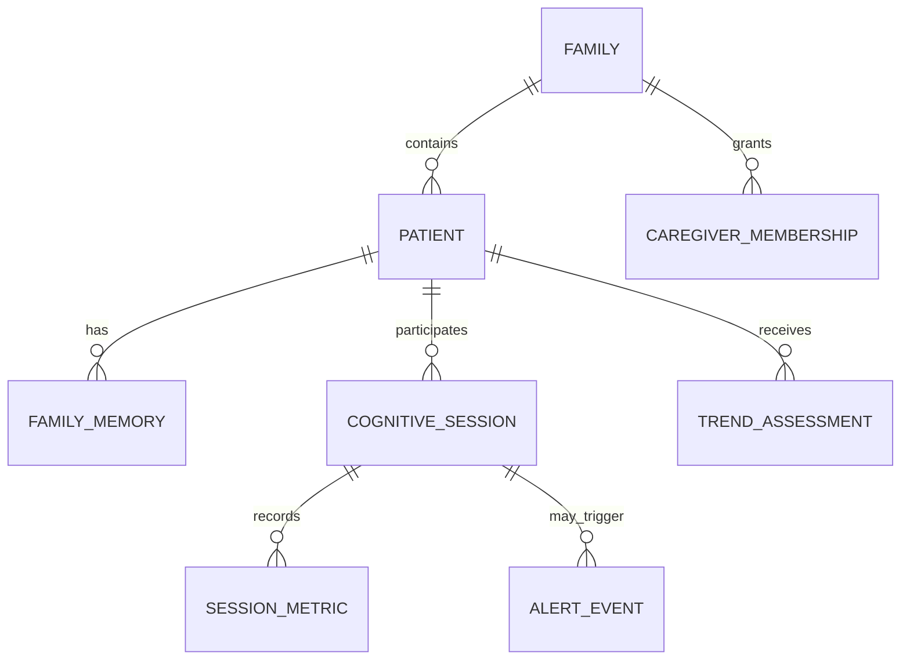

# Shared — Integration & Data Flow

**Platform:** Idea #003 — MDoNER AI-Based Cognitive Gaming and Memory Assistance Platform  
**Services:** Service A — Memory Assistance Calling Companion; Service B — Cognitive Gaming & Family Platform  
**Scope:** Hackathon prototype  
**Medical position:** The combined platform is an assistive cognitive-support and monitoring tool, not a diagnostic medical device. It reports observed participation/performance changes for caregiver interpretation; it does not diagnose dementia, determine progression, replace clinicians, or prescribe action.

## 1. Integration Goal

Service A and Service B are different patient interaction channels, not separate products:

- Service A reaches a patient through a normal Twilio phone call and writes call-derived observations.
- Service B provides caregiver management, patient games, game-derived observations, the internal ML layer, and the unified family view.
- Both use the same patient identity, cognitive-session entities, metric semantics, trend assessment, alert rules, and notification preferences.

The key integration outcome is:

> The family sees one coherent patient-level picture and does not need to understand which subsystem produced a signal before deciding whether to check in.

Source and activity remain available as explanatory detail because CALL and GAME observations must be normalized rather than pooled blindly.

## 2. Prototype System Boundary

The prototype is a **modular monolith**:

- one Next.js Service B web/PWA client;
- one FastAPI backend containing Service A, Service B, shared repositories, alert rules, and ML;
- one Supabase project for caregiver Auth, Postgres, and private Storage;
- one Twilio account for Voice and SMS;
- one APScheduler owner in the backend process.

Logical module separation supports clear ownership without adding internal HTTP calls, queues, service discovery, or distributed transactions.



## 3. Shared Terminology

| Term | Canonical meaning |
|---|---|
| `Family` | Caregiver-managed household/group container with `mode=SOLO|GROUP` |
| `Patient` | Person receiving calls and/or playing games; belongs to one family in the prototype |
| `FamilyCode` / `FamilyJoinCode` | Human-entered, short-lived one-time code generated for a specific patient and used by a caregiver to bind that patient device; not a patient password |
| `FamilyMemory` | Active, consented family person, relationship, voice, or milestone content |
| `CognitiveSession` | One call or game participation episode; the canonical cross-service unit |
| `SessionMetric` | One evaluated call item or game round with accuracy/latency/hesitation context |
| `source` | Exactly `CALL` or `GAME` |
| `activity_type` | `DAILY_CALL` or one of the six game types; used for comparability and explanation |
| `SAME_DAY` alert | Non-diagnostic signal of a potentially important observed change that may justify caregiver attention that day |
| `ROUTINE` | Ordinary participation/performance information retained for history/trends without urgent notification |
| `TrendAssessment` | Patient-level `stable`, `watch`, or `declining` observed-performance status with dates, sufficiency, features, and plain-language reason |
| Adaptive difficulty | Service B game-round recommendation of `easy`, `medium`, or `hard`; never a medical assessment |

## 4. Shared Entity Model



### 4.1 Identity, content, and settings

| Entity | Key fields | Cross-service purpose |
|---|---|---|
| `CaregiverAccount` | `caregiver_id`, `auth_user_id`, `created_at` | Maps Supabase caregiver identity to domain data |
| `Family` | `family_id`, `mode` (`SOLO`/`GROUP`), `created_at` | Parent authorization/data scope |
| `FamilyMembership` | `family_id`, `caregiver_id`, `role`, `created_at` | Allows caregiver access to family patients |
| `Patient` | `patient_id`, `family_id`, `preferred_name`, `phone_e164`, `timezone`, `preferred_language`, `high_energy_local_time`, `active` | Shared identity for CALL and GAME data |
| `FamilyJoinCode` | `join_code_id`, `family_id`, `patient_id`, `code_hash`, `expires_at`, `max_uses`, `used_at`, `created_by` | Patient-specific caregiver-assisted device setup |
| `PatientDevice` | `device_id`, `patient_id`, `token_hash`, `expires_at`, `revoked_at`, `last_seen_at` | No-password, patient-scoped game access |
| `Asset` | `asset_id`, `family_id`, `storage_path`, `media_type`, `checksum`, `size_bytes` | Private photo/voice object referenced by memories |
| `FamilyMemory` | `memory_id`, `patient_id`, `type`, person/relationship/prompt fields, `accepted_answers_json`, `asset_id`, `active`, `consent_recorded_at` | Powers Service A questions and Service B personal games |
| `CallSchedule` | `schedule_id`, `patient_id`, local time/time zone/days/quiet hours/language, `active`, retry fields | Configured in Service B; executed by Service A |
| `ReminderSetting` | `patient_id`, game reminder fields, `reminders_paused` | Controls Service B reminder behavior |
| `NotificationPreference` | `patient_id`, same-day/routine SMS flags, caregiver destination, `reminders_paused` | Shared policy for alerts/summaries |

### 4.2 Canonical `CognitiveSession`

| Field | Type / values | Semantics |
|---|---|---|
| `session_id` | UUID | Stable idempotency/relationship key |
| `patient_id` | UUID | Same patient ID across both services |
| `source` | `CALL` or `GAME` | Origin channel |
| `activity_type` | `DAILY_CALL`, `MEMORY_MATCH`, `FAMILY_TREE`, `MEMORY_TRAIN`, `MILESTONE_TIMELINE`, `FINISH_THE_STORY`, `CATEGORY_ALPHABET` | Activity stratum for history/ML |
| `started_at`, `ended_at` | UTC timestamp | Actual session boundary |
| `duration_ms` | non-negative integer | Derived elapsed duration |
| `status` | `IN_PROGRESS`, `COMPLETED`, `EARLY_TERMINATED`, `INTERRUPTED`, `FAILED`, `RESCHEDULED` | Common lifecycle vocabulary |
| `termination_reason` | nullable enum | Examples: `PATIENT_STOP`, `CONSECUTIVE_INCORRECT`, `REPEATED_NO_INPUT`, `CALL_DROPPED`, `APP_CLOSED`, `PROVIDER_FAILURE` |
| `session_score` | nullable 0–100 | Non-clinical analytic summary; never a patient reward or diagnosis |
| `summary_accuracy` | nullable 0–1 | Mean of scorable metrics only |
| `average_response_latency_ms` | nullable non-negative number | Mean of comparable evaluated responses |
| `hesitation_count` | non-negative integer | Observable repeats, explicit uncertainty, or timeouts—not inferred emotion |
| `review_classification` | `ROUTINE` or `SAME_DAY` | Result of the shared post-session rule evaluation; routine stays in session history |
| `metadata_json` | versioned JSONB | Seed/model/content version, scorable count, source-specific noncanonical fields |

### 4.3 Canonical `SessionMetric`

| Field | Type / values | Semantics |
|---|---|---|
| `metric_id` | UUID | Unique observation identifier |
| `session_id`, `patient_id` | UUID | Parent session and redundant integrity/speed field; must match parent |
| `item_type` | controlled string | Call question category or game round type |
| `accuracy` | nullable 0–1 | `1` correct, `0` incorrect, or fractional where a sequence has partial completion; `null` when unscorable/skipped |
| `average_response_latency_ms` | nullable non-negative number | GAME uses browser monotonic prompt-ready timing; CALL uses a consistently derived estimate from issued turn, known prompt duration, and webhook receipt. Average if a round has several sub-actions |
| `hesitation_count` | non-negative integer | Count of explicit “I do not know,” repeat requests, or defined timeouts |
| `difficulty` | `easy`, `medium`, `hard`, or null | Required for scorable GAME metrics; normally null for CALL |
| `recorded_at` | UTC timestamp | Observation time |
| `metadata_json` | versioned JSONB | `client_round_id`, content/model version, scorable count, and bounded source-specific detail |

### 4.4 Analysis and alert entities

| Entity | Key fields | Purpose |
|---|---|---|
| `DifficultyRecommendation` | patient/session/game/round, recommended/applied level, reason codes, model version | Reproducible adaptive game decision |
| `BanditState` | patient, game, arm matrices/vectors, observation count, model version | Small persisted LinUCB state |
| `TrendAssessment` | patient, status, reason, baseline/recent dates, accuracy/latency z, combined score, sufficiency, model version, created time | Combined observed-performance trend |
| `AlertEvent` | patient, supporting session, fixed `SAME_DAY` classification, reason code/text, delivery state, dedupe key, timestamps | Created only for same-day attention; SMS is a delivery attempt only |

## 5. Data Ownership

| Data | Creates | Updates/deletes | Reads | Ownership rule |
|---|---|---|---|---|
| Caregiver account/session | Supabase Auth + Service B | Caregiver/Service B | Service B auth guard | Service A never manages caregiver identity |
| Family, membership, patient | Service B | Authorized caregiver through Service B | A, B, ML, alerts | Service B is system of record |
| FamilyJoinCode, PatientDevice | Service B | Service B/caregiver revocation | Service B | Never exposed to Service A |
| FamilyMemory and Asset | Service B | Authorized caregiver | A question planner; B game catalog | Service A is read-only and uses active/consented items |
| CallSchedule | Service B settings API | Authorized caregiver/pause action | Service A scheduler | One table; no copied schedule state |
| Reminder/Notification preferences | Service B | Authorized caregiver | A, B, notification adapter | Pause propagates through shared state |
| CallAttempt and CallQuestion | Service A | Service A | Family history detail/operator | Provider/call-state data remains A-specific |
| GameRotationState | Service B | Service B transaction on game finalization | Service B | Calls do not alter rotation |
| CognitiveSession/SessionMetric `CALL` | Service A | Service A shared repository | B overview, ML, alert engine | A can write only CALL source |
| CognitiveSession/SessionMetric `GAME` | Service B | Service B shared repository | B overview, ML, alert engine | B game module can write only GAME source |
| DifficultyRecommendation/BanditState | Service B ML | Service B ML | B game runtime; audit detail | CALL history may be context, not bandit reward |
| TrendAssessment | Service B ML | Service B ML | Family overview, shared alert context | Always reads eligible CALL + GAME history |
| AlertEvent | Shared alert engine | Notification adapter updates delivery; caregiver acknowledges | Family overview | Same rules regardless of source |

No module copies `CognitiveSession` into a service-specific analytics table.

## 6. End-to-End Data Flows

### 6.1 Service A → Shared Data → ML / Alerts → Family

1. Service B caregiver settings create/update `Patient`, `FamilyMemory`, `CallSchedule`, and `NotificationPreference`.
2. Service A scheduler or operator creates a `CallAttempt` and `CognitiveSession(source=CALL,status=IN_PROGRESS)`.
3. Signed Twilio webhooks advance readiness and 5–8 question items.
4. Service A writes `CallQuestion` and `SessionMetric` observations; low-confidence STT is unscorable.
5. One transaction finalizes the `CognitiveSession` with aggregates and early/normal termination.
6. Shared alert rules evaluate the committed call.
7. Trend ML recomputes from eligible CALL and GAME history or the family overview returns the prior assessment with a freshness timestamp until recomputation completes.
8. The family overview shows the call within the mixed history, updated trend/reason, and any same-day alert.
9. If enabled, Twilio SMS delivers the already-persisted alert.

### 6.2 Service B → Shared Data → ML / Alerts → Family

1. A bound patient device receives rotation-filtered game options.
2. Service B creates `CognitiveSession(source=GAME,status=IN_PROGRESS)`.
3. Each idempotent round writes a `SessionMetric`; the difficulty service returns the next allowed level.
4. Completion, stop, or interruption finalizes the session and updates `GameRotationState` transactionally.
5. Shared alert rules evaluate the committed game session.
6. Trend ML recomputes over eligible CALL and GAME history.
7. The same family overview returns the game alongside calls, one trend, and any same-day alert.

### 6.3 Reverse flows

| From | To | Flow |
|---|---|---|
| Service B family management | Service A | Active family facts, relationships, aliases, voice clips, phone schedule, language, quiet hours |
| Shared recent CALL history | Service B difficulty | Caution feature/cap for the next game; never a direct game reward or diagnosis |
| Difficulty ML | Service B game runtime | `easy|medium|hard` recommendation plus applied safety override/reason |
| Trend ML | Family view / alert context | Patient-level status/reason with window dates and sufficiency |
| Caregiver pause | A scheduler and B reminders | Immediate suppression according to the selected shared pause scope |
| Caregiver deletion | A, B, ML, notifications | Revoke access/schedules first, then remove family-owned DB/Storage/Auth data |
| Alert acknowledgement | Shared alert record | Records caregiver review only; does not change medical state or training labels |

## 7. Write and Consistency Boundaries

### Service A session finalization

The final `CallQuestion` updates, `SessionMetric` rows, session aggregates, and terminal status commit together. Alert evaluation runs only after commit. A Twilio webhook retry uses `CallSid + call_question_id + transition` uniqueness and returns the previously generated next state.

### Service B game finalization

Round metrics are idempotent on `session_id + client_round_id`. Terminal session fields and `GameRotationState` update together. If rotation update fails, the session does not falsely report successful finalization; the client can retry the same completion request.

### Analysis freshness

`TrendAssessment` is derived and may lag the latest session briefly. The family response includes `assessment_created_at` and `latest_session_at`. If recomputation fails, the prior assessment stays visible with a stale/failed-refresh indication. Session data is never rolled back because ML is unavailable.

### Time semantics

- Store event timestamps in UTC.
- Store patient schedule/time preferences with an IANA time zone, usually `Asia/Kolkata` for the target region but not hard-coded.
- Day/time orientation uses the patient’s configured local time.
- Trend windows use patient-local calendar days, converted to UTC query boundaries.

## 8. ML Consumption Across Both Services

### 8.1 Shared eligibility filter

The trend feature builder reads both sources and includes:

- `COMPLETED` sessions;
- `EARLY_TERMINATED`/`INTERRUPTED` sessions with at least three scorable observations;
- non-null accuracy and latency values with valid timestamps;
- known activity/content/model versions.

It excludes:

- no-answer/provider-failed calls;
- duplicate observations;
- sessions containing only unscorable/skipped items;
- test/mock data outside the explicit demo-fixture environment;
- a newly introduced activity with no comparable baseline.

Early termination remains available to the alert engine even when too few metrics exist for the trend calculation.

### 8.2 Comparability before combination

CALL and GAME data have different timing and difficulty characteristics. The model therefore groups by `source + activity_type + difficulty` when possible, or by `source + activity_type` when a call has no difficulty. Only comparable strata present in both baseline and recent windows contribute to z-scores. Per-day/sample caps prevent one long game from overwhelming several short calls.

### 8.3 Trailing baseline and recent window

- **Baseline:** patient-local days D-21 through D-8 (14 days).
- **Recent:** D-7 through D0 (7 days).
- **Minimum sufficiency:** at least 5 baseline sessions across 5 days, 3 recent sessions across 3 days, and one comparable stratum.

For each stratum:

```text
accuracy_adverse_z = (baseline_accuracy_mean - recent_accuracy_mean)
                     / max(baseline_accuracy_sd, 0.05)

latency_adverse_z  = (recent_latency_mean - baseline_latency_mean)
                     / max(baseline_latency_sd,
                           0.10 * baseline_latency_mean,
                           250 ms)

combined_score     = 0.5 * max(0, accuracy_adverse_z)
                   + 0.5 * max(0, latency_adverse_z)
```

Accuracy and latency have equal weight so slower-but-correct change is not invisible.

### 8.4 Status mapping

| Status | Prototype heuristic | Required reason behavior |
|---|---|---|
| `stable` | Score `<1.0` and neither metric `>=1.5`; or provisional when data is insufficient | State no material observed change, or explicitly say history is insufficient/provisional |
| `watch` | Score `1.0–<2.0`, or one adverse metric `>=1.5` | Name slower responses and/or lower accuracy plus comparison window |
| `declining` | Score `>=2.0` with both metrics adverse, or persistent corroborated watch pattern | Say both measures changed and may need family attention; never say dementia worsened |

These values are explainable hackathon thresholds, not clinical cut-offs. Every record includes data sufficiency, counts, dates, contributing sources, and `model_version`.

### 8.5 Adaptive difficulty use of combined history

LinUCB learns its reward from GAME rounds only because CALL questions are not game-difficulty arms. Shared CALL history may contribute a bounded caution feature:

- recent slower/less accurate call observations can cap the first game round at easy;
- a current `watch`/`declining` state may block hard during cold start;
- it never locks the patient out or presents a medical reason;
- in-session safety signals always override the bandit.

## 9. Same-Day Alert Logic

The alert engine answers a narrower question than the trend model: “Did this finalized session or its combined context contain a potentially important change that a family member may reasonably want to review today?”

### 9.1 Decision table

| Observation | Classification | Conditions / suppression | Reasoning |
|---|---|---|---|
| Complete family-recognition failure | `SAME_DAY` | At least two scorable family-recognition items, all incorrect | Strong familiar-information change; still not diagnostic |
| Safety-related early termination | `SAME_DAY` candidate | Repeated difficulty threshold or explicit stop in that context; not ordinary voluntary stop | Patient comfort event plus performance context merits review |
| Combined baseline deviation | `SAME_DAY` | Sufficient history; accuracy `>=2 SD` worse **and** latency `>=1.5 SD` slower | Requires corroboration, reducing alerts from one noisy metric |
| One extreme metric + corroborating signal | `SAME_DAY` candidate | Extreme adverse z plus repeated hesitation/no-input or unusual early termination | Multiple indicators are more credible than a single fluctuation |
| One incorrect/slow response | `ROUTINE` | Always | Normal variation is expected |
| Low-confidence/unscorable STT | `ROUTINE` | Always unless another independent severe rule holds | Provider uncertainty is not patient failure |
| Game interruption/app close | `ROUTINE` | Unless paired with explicit safety/difficulty signal | Technical/ordinary stop is not cognitive evidence |
| Twilio busy/no-answer/provider failure | Operational routine | Never a cognitive alert | No patient performance was observed |
| Ordinary completed session | `ROUTINE` | No severe rule | Included in history/weekly trend only |

### 9.2 Alert restraint

- A rule must name its evidence and supporting `session_id`.
- Only one `AlertEvent` can use the same dedupe key.
- Repeated evaluations update nothing if the same event already exists.
- A cooldown may suppress duplicate SMS for the same reason within six hours while retaining each session in history.
- Wording uses “observed,” “slower,” “less accurate,” “ended early,” “may need attention,” or “consider checking in.”
- Wording never uses “diagnosed,” “deteriorated,” “dementia progressed,” or a treatment recommendation.

### 9.3 Routine reporting

Routine information contributes to:

- chronological session history;
- participation/completion summary;
- weekly/general trend context;
- later baseline/recent calculations;
- caregiver review when desired.

Routine information does not generate repeated urgent SMS.

## 10. Unified Family View

The caregiver receives one patient-level response containing:

| Information | Unified behavior |
|---|---|
| Patient identity/settings | One profile regardless of enabled services |
| Recent activity | CALL and GAME in one chronological sequence; source/activity available as detail |
| Participation | Session date, duration, completion/termination, without a correctness-based patient reward |
| Observations | Accuracy, latency, hesitation, and scorable counts with activity context |
| Trend | One current stable/watch/declining status derived from eligible CALL + GAME metrics |
| Explanation | Plain-language reason, baseline/recent dates, data sufficiency, and contributing source types |
| Attention and routine reporting | Routine classification stays on session history; same-day `AlertEvent` rows include supporting session, created time, acknowledgement, and delivery status |
| Freshness | Latest session and assessment timestamps so stale ML is visible |

The default interpretation is patient-level. Source filtering is an explanatory/debug option, not a requirement for understanding the headline.

## 11. Integration Boundaries

### Independent responsibilities

| Service A only | Service B only |
|---|---|
| Twilio outbound-call creation | Caregiver authentication and family onboarding |
| TwiML call state/readiness/question flow | FamilyCode and patient-device binding |
| CallAttempt/CallQuestion/provider status | Six game adapters/runtime |
| Call-specific answer evaluator and voice playback | Game rotation and patient daily choices |
| Call scheduler execution/reschedule | Contextual-bandit state/recommendation |

### Must be shared

- `Family`, `Patient`, active `FamilyMemory`, schedules/preferences.
- `CognitiveSession` and `SessionMetric` schema, repository rules, IDs, timestamps, statuses, sources, and metric meanings.
- `TrendAssessment` feature input and unified patient interpretation.
- Same-day/routine classification rules, wording constraints, deduplication, and same-day-only `AlertEvent`.
- Family overview/session history contract.
- Pause and deletion propagation.
- Non-diagnostic, no-shame, no-dark-pattern policies.

## 12. Failure Scenarios and Prototype Fallbacks

| Failure | System behavior | Family/demo behavior |
|---|---|---|
| Twilio call creation fails | Mark `CallAttempt`/session `FAILED` with provider-safe code; optional one schedule retry; no cognitive metrics/alert | Show operational missed call as routine, not decline; operator can use labelled mock flow |
| Call is busy/no-answer | Status callback finalizes provider outcome; no performance inference | Routine history only; never same-day cognitive alert |
| Twilio webhook/STT fails mid-call | Repeat once if safe; otherwise end warmly and store interruption/unscorable state | Partial scorable metrics may remain; technical cause identified; no automatic blame |
| Family voice asset cannot play | Skip item and exclude it from accuracy | Continue call/game; record asset error for caregiver/operator |
| Game session is interrupted | Persist acknowledged rounds; finalize `INTERRUPTED`; move game to rotation back | Allow later choice without penalty; include in trend only if at least three scorable observations |
| Duplicate round/webhook | Unique idempotency key returns prior result | No duplicate metric/session/alert |
| ML recomputation unavailable | Session write and rule-based alerts still succeed; keep previous `TrendAssessment` | Show assessment timestamp/stale state; do not fabricate a new status |
| Insufficient ML history | Store provisional `stable` with `data_sufficiency=insufficient`; baseline-deviation alerts disabled | Plain reason says more history is needed |
| Shared-data write fails during call | Return the safest possible closing TwiML; log redacted failure; bounded in-process retry only | Do not claim the session was saved; operator may replay a fixture. Production outbox is future work |
| Shared-data write fails during game | Client retains one idempotent pending payload and offers retry/clean exit | Do not advance rotation or claim completion until commit succeeds |
| Alert persistence fails | Do not send an unsupported SMS; surface backend error for retry | No message without durable evidence |
| Alert SMS fails | Keep `AlertEvent`; set delivery failed/pending; allow one manual retry | Family still sees the in-app same-day alert |
| Database/Supabase unavailable | Disable new authoritative writes; existing client may show clearly stale cached state | Switch judge demo to labelled deterministic fixtures/read-only evidence; do not fake live success |
| Patient device token revoked/expires | Reject patient API; require caregiver to create a new code/binding | No patient password recovery flow |
| Account deletion partly fails | Revoke access/schedules/devices first; persist visible deletion job/error for immediate operator retry | No retention prompt; never claim complete deletion while assets remain |

Fallbacks are intentionally simple. A production-grade durable outbox, multi-provider failover, disaster recovery, and formal incident response are future work.

## 13. Privacy, Safety, and Ethical Controls

- Use synthetic data for the judge demo unless every real person has consented.
- Keep family assets private and issue short-lived access URLs.
- Do not record patient call audio or perform passive microphone/camera monitoring.
- Store only transcript fragments/answers needed for the call record; omit sensitive content from logs.
- Treat low-confidence speech as unscorable, never automatically incorrect.
- Patient can stop/skip; 2–3 consecutive incorrect answers trigger simplification/early termination rather than pressure.
- Praise effort, not correctness. Internal bandit reward is never a patient-facing reward.
- No ads, guilt, streak rescue, forced interaction, confirmation maze, or retention prompt.
- Pause reminders, settings changes, and deletion each remain one straightforward action path.
- Every trend/alert identifies itself as observed-performance support and leaves interpretation/escalation to the caregiver.

## 14. Integration Verification Matrix

| Test | Expected result |
|---|---|
| Service A completed call | One CALL session, metrics, and mixed family-history entry |
| Service B completed game | One GAME session, metrics, rotation update, and mixed history entry |
| Same patient, both sources | One overview and one trend assessment using comparable CALL + GAME strata |
| Slower-but-correct recent window | Latency contributes to watch even when accuracy is unchanged |
| Combined adverse recent window | Declining fixture has both adverse z-scores and a non-diagnostic reason |
| Insufficient history | Provisional/low-sufficiency state; no baseline-deviation same-day alert |
| Severe CALL recognition failure | One SAME_DAY event; optional SMS; supporting source visible |
| Severe GAME recognition failure | Same alert contract and wording as CALL |
| Ordinary mistake or interruption | Routine only; no urgent message |
| Duplicate webhook/round/finalization | No duplicate metrics, rotation changes, assessments, alerts, or SMS |
| Pause | Relevant Service A schedule and Service B reminders stop immediately |
| Account deletion | Caregiver/patient access revoked; shared data/assets removed or accurately marked pending without retention flow |

## 15. Minimum Integrated Demo

1. Caregiver opens a pre-seeded synthetic group family and shows two patient profiles.
2. Caregiver creates a FamilyCode and binds a patient device.
3. Patient chooses a rotation-eligible game and completes several no-typing rounds.
4. Difficulty visibly changes according to a seeded context, then a safety override lowers it after repeated difficulty.
5. Service B finalizes a GAME session into the shared model.
6. Service A places or replays a clearly labelled real/mock call and finalizes a CALL session for the same patient.
7. Family overview shows both in one chronological history.
8. Trend assessment uses D-21..D-8 baseline and D-7..D0 recent accuracy/latency, with data sufficiency and plain-language reason.
9. A routine fixture remains quiet; one severe fixture creates a same-day alert and optional SMS.
10. Caregiver pauses reminders in one action.

This sequence proves product coherence. Infrastructure diagrams alone do not.

## 16. Cross-System Consistency Check

- [x] Both services use the same `Patient`, `CognitiveSession`, `SessionMetric`, `AlertEvent`, and `TrendAssessment` concepts.
- [x] Service A contributes call-derived cognitive metrics with `source=CALL`.
- [x] Service B contributes game-derived cognitive metrics with `source=GAME`.
- [x] The ML trend layer consumes eligible observations from both sources and adjusts for source/activity/difficulty before combination.
- [x] Adaptive difficulty is a Service B game feature; shared CALL history may provide bounded caution context, while game rounds provide the bandit reward.
- [x] The caregiver receives one unified patient history, trend, explanation, and alert list.
- [x] Same-day alerts can originate from a qualifying CALL or GAME session under the same restrained rules.
- [x] Low-confidence STT, provider failure, ordinary mistakes, and ordinary interruption do not become cognitive decline claims.
- [x] Patient dignity, effort-based praise, early stopping, no diagnosis, no ads, and direct pause/settings/deletion apply across both services.
- [x] The build remains hackathon-feasible: one PWA, one modular FastAPI backend, one shared Postgres/Storage/Auth project, Twilio, and small transparent ML algorithms.
